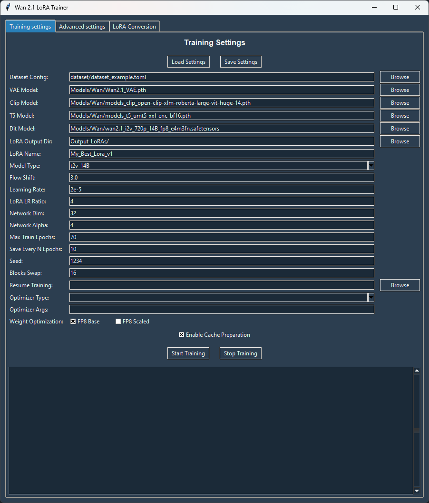

# Simple GUI for [Musubi Tuner](https://github.com/kohya-ss/musubi-tuner) (Wan 2.1 models only)


# How to use GUI

- Download the repository by running in the command line:
`git clone https://github.com/Kvento/musubi-tuner-wan-gui`

- To open the GUI just run `Start_Wan_GUI.bat`.
- All settings can be saved and loaded using the "**Load Settings**" and "**Save Setting**" buttons.
- More info about settings see in [Wan2.1 documentation](./docs/wan.md), [Advanced Configuration](./docs/advanced_config.md#fp8-quantization), [Dataset configuration guide](./dataset/dataset_config.md).





# Miscellaneous


## SageAttention Installation

sdbsd has provided a Windows-compatible SageAttention implementation and pre-built wheels here:  https://github.com/sdbds/SageAttention-for-windows. After installing triton, if your Python, PyTorch, and CUDA versions match, you can download and install the pre-built wheel from the [Releases](https://github.com/sdbds/SageAttention-for-windows/releases) page. Thanks to sdbsd for this contribution.

For reference, the build and installation instructions are as follows. You may need to update Microsoft Visual C++ Redistributable to the latest version.

1. Download and install triton 3.1.0 wheel matching your Python version from [here](https://github.com/woct0rdho/triton-windows/releases/tag/v3.1.0-windows.post5).

2. Install Microsoft Visual Studio 2022 or Build Tools for Visual Studio 2022, configured for C++ builds.

3. Clone the SageAttention repository in your preferred directory:
    ```shell
    git clone https://github.com/thu-ml/SageAttention.git
    ```

    You can skip step 4 by using the sdbsd repository mentioned above by `git clone https://github.com/sdbds/SageAttention-for-windows.git`.

4. Open `math.cuh` in the `SageAttention/csrc` folder and change `ushort` to `unsigned short` on lines 71 and 146, then save.

5. Open `x64 Native Tools Command Prompt for VS 2022` from the Start menu under Visual Studio 2022.

6. Activate your venv, navigate to the SageAttention folder, and run the following command. If you get a DISTUTILS not configured error, set `set DISTUTILS_USE_SDK=1` and try again:
    ```shell
    python setup.py install
    ```

This completes the SageAttention installation.

### PyTorch version

If you specify `torch` for `--attn_mode`, use PyTorch 2.5.1 or later (earlier versions may result in black videos).

If you use an earlier version, use xformers or SageAttention.


# License

Code under the `hunyuan_model` directory is modified from [HunyuanVideo](https://github.com/Tencent/HunyuanVideo) and follows their license.

Code under the `wan` directory is modified from [Wan2.1](https://github.com/Wan-Video/Wan2.1). The license is under the Apache License 2.0.

Other code is under the Apache License 2.0. Some code is copied and modified from Diffusers.
